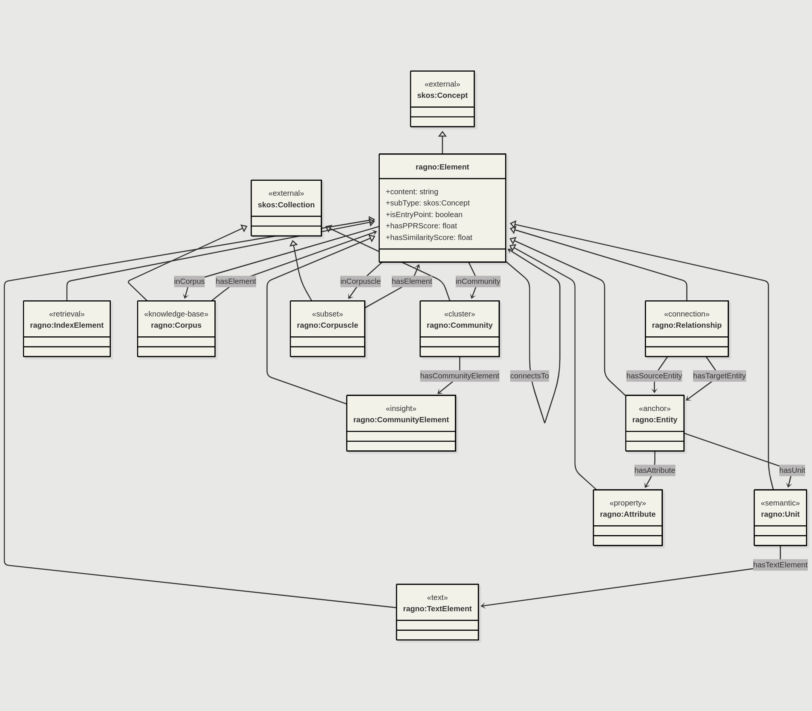

# Ragno Ontology

Ragno is an RDF/OWL ontology for describing graph knowledgebases. The aim is to represent diverse kinds of information in a coherent fashion, to allow efficient and flexible systematic retrieval and augmentation. While this is in principle a generic representation, it is designed primarily to support Retrieval Augmented Generation (RAG) with LLMs.

**Status: 2025-05-25 :** terms are untidily structured but should be adequate to begin testing in experimental deployment. Docs currently mostly AI-generated, manual intervention required.

*I had a rough draft of a model in mind, which I'd been just-in-time developing for [Semem](https://github.com/danja/semem) "Semantic Memory", but then stumbled on the paper [NodeRAG: Structuring Graph-based RAG with Heterogenous Nodes](https://arxiv.org/abs/2504.11544) which was a remarkably close fit, on top of which the authors have developed algorithm strategies to use it, so with minor changes in terminology and a representation in RDF, here we go.*

- [Description](description.md)
- [Definition](ragno.ttl) - Turtle RDF



This is very much an umbrella specification, there is only minor specialization from the generic `skos:Concept`. Relationships between entities are lifted into instances in their own right to enable description in a property graph*-envious* fashion. Community in this context refers to groups of elements that by some measure display clustering. The intention with Ragno is to diverge from the model in the [NodeRAG paper](https://arxiv.org/abs/2504.11544) and treat a *Community* in a similar manner to elements. While the paper has practical purposes in distinguishing between levels of granularity - from label/description, to text chunk and upwards through *concept* in abstraction, it is felt that at a model level, the RDF universe, these distinctions aren't essential.  

Following (Semantic) Web practices, all elements will be assumed to be retrievable (ignore what the current diagram says). 


*Slop Commences...*

## Overview

Ragno models heterogeneous knowledge graphs with seven element types extending `skos:Concept`, supporting dual search and Personalized PageRank for precise information retrieval.

## Quick Start

```turtle
@prefix ragno: <http://purl.org/stuff/ragno/> .

ex:entity1 a ragno:Entity ;
    rdfs:label "Geoffrey Hinton" ;
    ragno:hasUnit ex:unit1 .

ex:unit1 a ragno:Unit ;
    ragno:content "Hinton won the Nobel Prize for AI" .
```

## Documentation


## Key Features

- **SKOS Integration**: Elements as concepts, communities as collections
- **PROV-O Support**: Document provenance and query tracking  
- **Dual Search**: Exact matching + vector similarity
- **Named Graphs**: Modular pipeline stages

## Directory Structure

```
ragno/
├── README.md
├── ontology/
│   └── ragno.ttl
├── examples/
│   ├── sample-data.ttl
│   └── queries.sparql
├── diagrams/
│   ├── class-diagram.mmd
│   ├── pipeline.mmd
│   ├── query-flow.mmd
│   ├── architecture.mmd
│   └── llm-sequences.mmd
└── docs/
    ├── overview.md
    └── noderag-appendix.md
```

## Element Types

| Type | Description | NodeRAG Term |
|------|-------------|--------------|
| `ragno:Entity` | Named entities | Entity (N) |
| `ragno:Unit` | Semantic events | Semantic Unit (S) |
| `ragno:TextElement` | Original text | Text (T) |
| `ragno:CommunityElement` | Community insights | High-Level Element (H) |
| `ragno:CoreElement` | Core concepts | High-Level Overview (O) |

## License

Based on NodeRAG by Xu et al. License: [TBD]